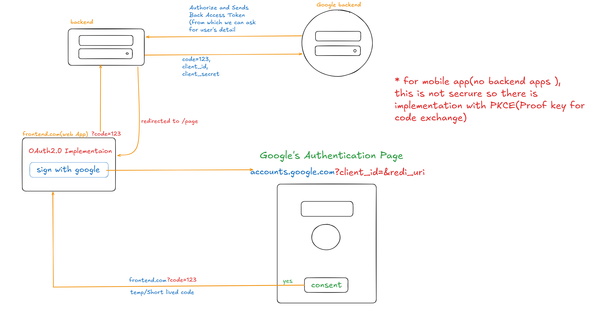

# 🔐 OAuth2.0 Authentication with JWT (Frontend + Backend)

This project demonstrates a complete **OAuth2.0 authentication flow** with **JWT integration**, covering both frontend and backend implementation.  

## 🔄 Flow

## 🚀 Features
- OAuth2.0 authentication flow
- JWT generation and validation
- Secure communication between frontend & backend
- Session handling with token storage

---
✅ A simple, secure example of implementing **OAuth2.0 + JWT** end-to-end.
